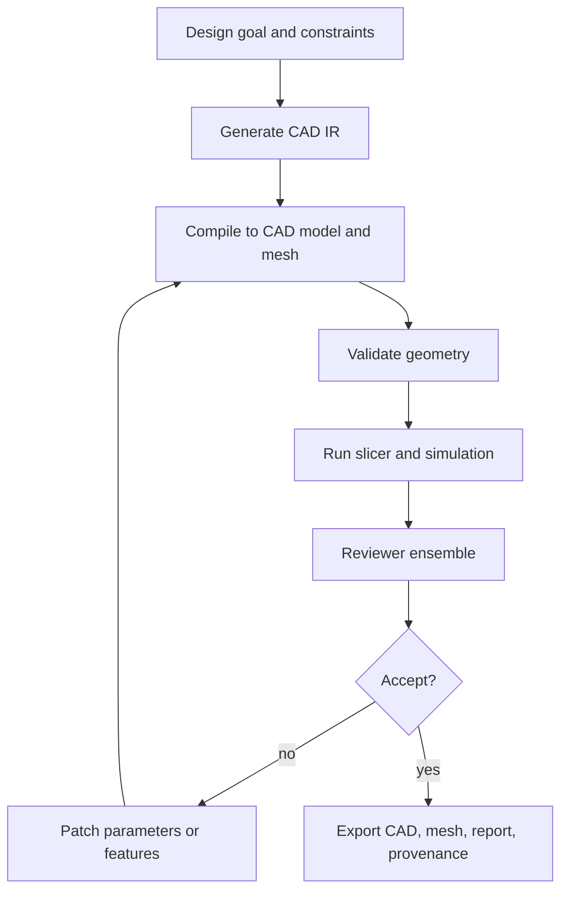

# VIGOR Adoption Plan: Agentic CAD

## Goal

Adopt VIGOR for CAD workflows that generate editable parametric models, validate physical and manufacturing constraints, simulate performance, and iterate toward a design goal.

The target pipeline is:

```text
design intent -> parametric CAD IR -> geometry compile -> simulation/review -> patch features -> export CAD package
```

## Why CAD Needs VIGOR

CAD generation cannot be trusted as a one-shot mesh. The output must be editable, constrained, manufacturable, and often physically safe.

VIGOR's representation-first loop maps naturally to CAD because parametric CAD already separates design intent from geometry realization.

## CAD IR

Candidate IR options:

| IR | Best For |
| --- | --- |
| OpenSCAD script | Simple constructive solid geometry and reproducibility |
| FreeCAD Python | Parametric feature trees and constraints |
| CadQuery script | Programmatic CAD with Python workflow |
| Feature graph JSON | Tool-neutral intermediate model |
| STEP plus metadata | Exchange format with limited parametric editability |

Recommended initial IR:

```json
{
  "ir_type": "cad_parametric.v1",
  "units": "mm",
  "intent": "Wall-mounted bracket for a 2 kg device",
  "constraints": {
    "load_kg": 2.0,
    "mounting_screw_count": 4,
    "max_width_mm": 120,
    "printable_on_fdm": true,
    "min_wall_thickness_mm": 3
  },
  "parameters": {
    "width_mm": 100,
    "height_mm": 80,
    "depth_mm": 35,
    "fillet_radius_mm": 4
  },
  "features": [
    {"type": "base_plate", "width": "width_mm", "height": "height_mm", "thickness": 5},
    {"type": "rib", "count": 3, "thickness": 4},
    {"type": "mounting_holes", "count": 4, "diameter_mm": 4.5}
  ]
}
```

## Compiler And Reviewer Stack

### Compiler Tools

| Tool | Purpose |
| --- | --- |
| CadQuery/OpenSCAD/FreeCAD | Generate editable model and mesh |
| Geometry kernel | Validate solids and boolean operations |
| Mesh exporter | Export STL/OBJ/3MF |
| STEP exporter | Export CAD exchange model |
| Slicer | Validate 3D printability and estimate time/material |
| FEM simulator | Stress/displacement evaluation |

### Reviewers

| Reviewer | Signal |
| --- | --- |
| Constraint validator | Dimensions, units, screw locations, clearances |
| Geometry validator | Watertightness, non-manifold edges, self-intersections |
| Manufacturability reviewer | Minimum wall thickness, overhangs, tolerances, material use |
| FEM reviewer | Stress, displacement, safety factor |
| Assembly reviewer | Fit with mating parts and fasteners |
| VLM visual reviewer | Does the rendered model match intent and references |
| Safety reviewer | Load, failure mode, regulatory or hazard checks |

## CAD Loop



## Patch Types

| Finding | Patch |
| --- | --- |
| Stress too high | Increase rib thickness, add gussets, change material |
| Print overhang too steep | Add chamfer, split part, change orientation |
| Hole misaligned | Adjust constraint or coordinate reference |
| Non-manifold mesh | Change boolean operation order or feature geometry |
| Too much material | Reduce infill recommendation, remove unnecessary bulk |
| Violates max dimensions | Scale or redesign feature layout |

## Safety Policy

CAD VIGOR must distinguish prototypes from load-bearing or safety-critical parts.

| Classification | Policy |
| --- | --- |
| Decorative/non-functional | Automated loop can finalize with report |
| Consumer functional | Require manufacturability and constraint checks |
| Load-bearing | Require simulation and human engineer approval |
| Safety-critical | Require certified engineering workflow outside VIGOR |

VIGOR should not claim certification. It can produce evidence packages for qualified review.

## Required Engineering Metadata

CAD review is only meaningful when assumptions are explicit.

| Metadata | Why It Matters |
| --- | --- |
| Material | Strength, stiffness, thermal behavior, print settings |
| Load cases | Forces, moments, direction, duration, dynamic vs static load |
| Boundary conditions | Fixed faces, fasteners, contact surfaces, constraints |
| Tolerances | Fit, clearance, manufacturing process limits |
| Manufacturing process | FDM, SLA, CNC, sheet metal, injection molding |
| Safety factor | Required margin for intended use |
| Solver settings | Mesh density, solver type, convergence, simplifications |

Acceptance reports must state solver limitations and must not imply certification. Load-bearing, regulated, or safety-critical designs require qualified human engineering signoff before production use.

## Implementation Plan

### Phase 1: Parametric Script Adapter

| Task | Output |
| --- | --- |
| Choose CadQuery or FreeCAD as first compiler | Runnable adapter |
| Define CAD IR schema | `cad_parametric.v1` |
| Add geometry validation | Compile result with mesh metrics |
| Export STL and STEP | Export bundle |

### Phase 2: Manufacturing Review

| Task | Output |
| --- | --- |
| Add slicer integration | Printability report |
| Add wall thickness and clearance checks | Objective metrics |
| Add visual render snapshots | Review artifacts |
| Add VLM model-intent review | Structured critique |

### Phase 3: Simulation Review

| Task | Output |
| --- | --- |
| Integrate FEM simulation | Stress/displacement report |
| Add load-case schema | Simulation input IR |
| Add safety factor policy | Hard gate for load-bearing parts |

### Phase 4: Harness Optimization

| Task | Output |
| --- | --- |
| Build CAD benchmark set | Search and held-out splits |
| Compare IR variants | Feature graph vs script |
| Optimize patch prompts and review thresholds | Versioned harness policies |

## Acceptance Criteria

1. Generate an editable CAD script from a structured design goal.
2. Compile to a valid model and mesh.
3. Detect at least one geometry or manufacturability failure.
4. Patch the IR based on the failure and improve the metric.
5. Export CAD artifact, mesh, validation report, and provenance.
6. For load-bearing designs, include material, load-case, boundary-condition, solver, and human-signoff fields.
