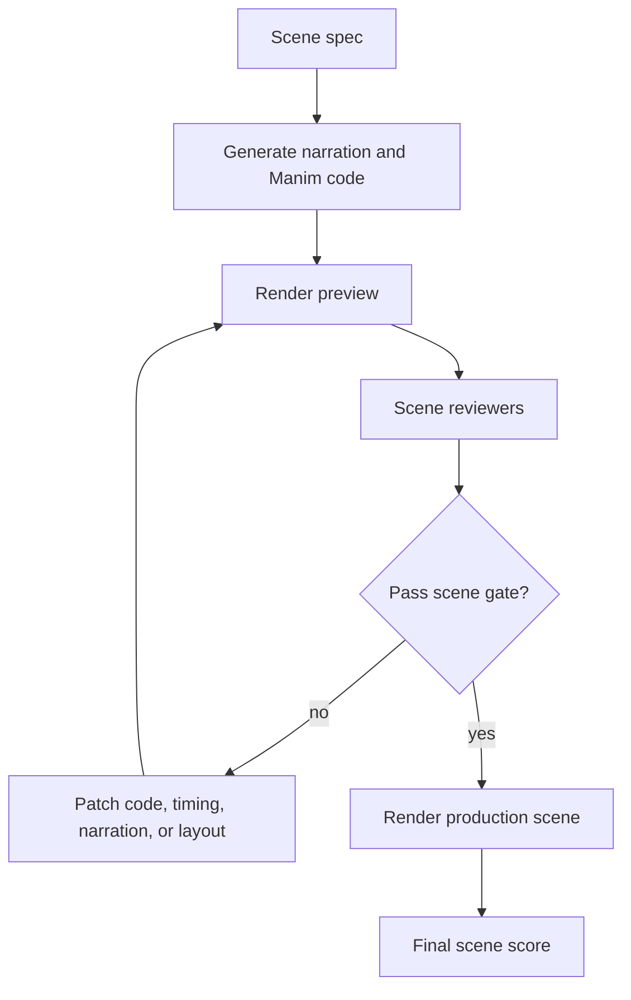
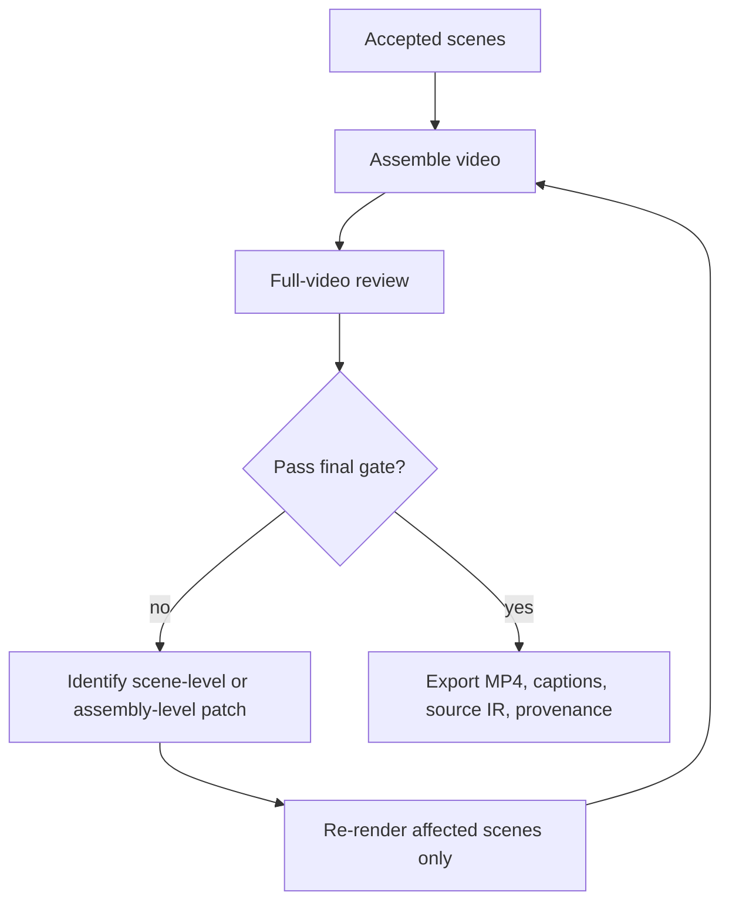

# VIGOR Adoption Plan: Agentic Video Generation And AIECF

Status: **scope-gated.** Per the readiness assessment (C7/C8/K7), `vigor-adapter-video-aiecf` is split into two packages:

1. `vigor-adapter-video-manim` (future): a standalone Manim-based video adapter. Deferred until (a) a Manim environment is wired into CI, (b) a small set of scene prompts is curated, and (c) VideoScore2 is either available on GPU or accepted in shadow mode. No package has been scaffolded yet because a non-rendering stub would be misleading.
2. `vigor-adapter-video-aiecf` (future): a thin compatibility layer on top of `vigor-adapter-video-manim` that wraps an existing AIECF-style pipeline. Deferred until the downstream AIECF repository is identified and access is confirmed.

## Goal

Adopt VIGOR as the orchestration framework for agentic educational video generation, including systems like AI Education Content Factory.

The target pipeline is:

```text
learning goal -> storyboard/script/scene IR -> compile/render video -> score/review -> refine -> final video + editable recipe
```

## Why AIECF-Style Systems Are A Strong Fit

This plan is written for AIECF-style scene-based educational video systems. The concrete mapping below should be verified against the target repository before implementation. If a specific AIECF deployment does not use a listed component, treat the row as an adapter candidate rather than an asserted fact.

| Assumed Existing Pattern | VIGOR Mapping |
| --- | --- |
| LLM storyboard/script/code generation | Generator over editable scene IR |
| Manim rendering | Compiler/renderer adapter |
| ffmpeg assembly | Compiler/export stage |
| Gemini or VLM critique | Reviewer adapter |
| Quality thresholds and refinement | Adjudication and patch loop |
| Redis/RQ workers | Tool provider and async compile/review workers |
| Scene map-reduce | Candidate graph and domain adapter composition |

## Assumptions To Verify

| Assumption | Verification Needed |
| --- | --- |
| Scene-based generation exists | Inspect pipeline services and data models |
| Manim or another executable renderer is used | Inspect render worker or compiler service |
| VLM/Gemini critique exists | Inspect review/evaluation services and prompts |
| Redis/RQ or equivalent async workers exist | Inspect infrastructure and worker configuration |
| Final assembly uses ffmpeg or equivalent | Inspect media assembly code |
| Quality gates already affect refinement | Inspect threshold and retry logic |

## Proposed Video IR

```json
{
  "ir_type": "educational_video.v1",
  "topic": "Bayes theorem",
  "audience": "high school statistics",
  "style": {
    "visual": "clean explanatory animation",
    "pace": "calm",
    "accessibility": ["high contrast", "large text", "captions"]
  },
  "scenes": [
    {
      "id": "scene_001",
      "duration_s": 22,
      "learning_objective": "Explain conditional probability intuitively",
      "narration": "Bayes theorem helps us update beliefs when new evidence arrives.",
      "visual_plan": {
        "type": "manim_scene",
        "objects": ["prior probability bar", "evidence icon", "posterior probability bar"],
        "transitions": ["prior shrinks", "posterior grows"]
      },
      "code_uri": "scenes/scene_001.py",
      "acceptance_criteria": [
        "No text cutoff",
        "Narration aligns with animation",
        "Bayes formula appears legibly",
        "Scene objective is satisfied"
      ]
    }
  ]
}
```

## Adapter Contract

### Compiler Tools

| Tool | Purpose |
| --- | --- |
| Manim renderer | Compile scene code to MP4 |
| Preview renderer | Low-cost scene render for early review |
| ffmpeg assembler | Combine scenes, audio, captions, transitions |
| Caption renderer | Generate or burn captions |
| Browser renderer | Optional for HTML/SVG animation scenes |

### Reviewer Tools

| Reviewer | Signal |
| --- | --- |
| VideoScore2 | Visual quality, text-video alignment, common-sense/physical consistency |
| VLM scene critic | Pedagogical clarity, visual mismatch, text legibility |
| Continuity reviewer | Scene boundary consistency and narrative flow |
| Audio reviewer | LUFS, clipping, narration timing, silence gaps |
| Accessibility reviewer | Contrast, caption availability, text size, flashing content |
| Education reviewer | Learning objective coverage, misconception risk |

## VIGOR Loop For A Scene



## VIGOR Loop For A Full Video



## Scoring Policy

Initial scoring should run in hybrid mode.

| Phase | Gate |
| --- | --- |
| Calibration | Store VideoScore2 and current VLM scores; keep existing gate as source of truth |
| Shadow mode | Compare scorer disagreement against human spot checks |
| Partial cutover | Use VideoScore2 for best-of-N selection, keep VLM critique for repair suggestions |
| Full cutover | Gate on composite policy with fallback reviewer on scorer failure |

Example score policy:

```json
{
  "visual_quality_min": 0.60,
  "alignment_min": 0.65,
  "physical_consistency_min": 0.60,
  "education_clarity_min": 0.70,
  "accessibility_required": true,
  "hard_failures": ["render_error", "text_cutoff", "unsafe_or_false_instruction"]
}
```

## Implementation Plan

### Phase 1: Wrap Existing Pipeline

| Task | Output |
| --- | --- |
| Define `educational_video.v1` IR | JSON schema |
| Add VIGOR run archive | Per-run candidate folders |
| Wrap Manim worker as compiler adapter | Compile result schema |
| Wrap current critique as reviewer adapter | Review report schema |
| Store final provenance | `provenance.json` |

### Phase 2: Add VideoScore2 And Reviewer Ensemble

| Task | Output |
| --- | --- |
| Add VideoScore2 scorer service or queue worker | GPU-backed reviewer |
| Add accessibility and audio reviewers | Objective signals |
| Add score normalization | Unified score report |
| Run hybrid scoring | Calibration corpus |

### Phase 3: Add Frontier Search

| Task | Output |
| --- | --- |
| Generate multiple scene variants | Candidate branches |
| Score each candidate | Frontier table |
| Select by composite plus hard gates | Best candidate |
| Preserve non-final candidates | Auditability and regression data |

### Phase 4: Meta-Harness-Style Optimization

| Task | Output |
| --- | --- |
| Build benchmark suite of educational prompts | Search and held-out splits |
| Optimize prompt templates and review policy | Harness candidates |
| Track Pareto frontier | Quality vs cost vs latency |
| Promote harness versions | Versioned production policies |

## Acceptance Criteria

1. A scene can run through VIGOR as a standalone candidate.
2. A render failure becomes a structured patch objective.
3. A review failure becomes a structured patch objective.
4. Final export includes video, source IR, code, score report, and provenance.
5. At least one best-of-N run selects a non-last candidate based on stored scores.
6. Human reviewers can inspect why a scene was accepted or rejected.

## Risks

| Risk | Mitigation |
| --- | --- |
| Scorer does not correlate with human preference | Run hybrid calibration and human spot checks |
| GPU scorer latency is high | Use async queue worker and preview/final score tiers |
| VLM critique is vague | Require structured findings and evidence references |
| Scene improvements regress full-video flow | Add final assembly review and continuity checks |
| Prompt leakage into benchmarks | Separate search and held-out evaluation sets |
