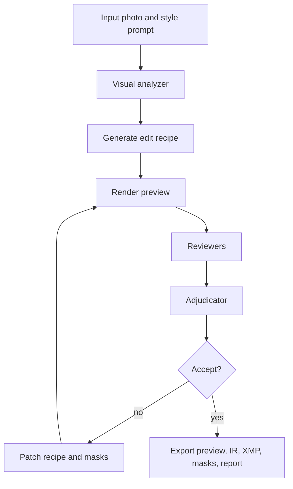

# VIGOR Adoption Plan: Agentic Photo Editing

## Goal

Adopt VIGOR for automatic aesthetic photo editing that produces editable recipes rather than opaque pixel edits.

The target pipeline is:

```text
input image + style intent -> photo edit IR -> render preview -> aesthetic/technical review -> patch recipe -> export XMP/PSD/GIMP/LUT
```

## Design Principle

Photo editing VIGOR should not start as a black-box image-to-image model. The product value is editability.

The system should output:

1. A rendered preview.
2. A portable edit recipe.
3. Masks and local adjustments.
4. Editor-specific exports.
5. A review report explaining the edit.

## Photo Edit IR

```json
{
  "ir_type": "photo_edit_recipe.v1",
  "intent": "warm cinematic rainforest landscape with protected shadows",
  "global_adjustments": {
    "exposure": -0.1,
    "contrast": 18,
    "highlights": -35,
    "shadows": 12,
    "whites": 5,
    "blacks": -12,
    "temperature": 8,
    "vibrance": -5,
    "clarity": -8,
    "dehaze": 4,
    "noise_reduction_color": 20,
    "sharpening": 15
  },
  "local_adjustments": [
    {
      "target": "sky_and_ridge_light",
      "mask_type": "semantic_or_gradient_mask",
      "adjustments": {
        "temperature": 12,
        "contrast": 10,
        "highlights": -10
      }
    },
    {
      "target": "hut",
      "mask_type": "object_mask",
      "adjustments": {
        "exposure": 0.35,
        "shadows": 35,
        "whites": 15
      }
    }
  ],
  "constraints": [
    "avoid clipped highlights",
    "avoid radioactive greens",
    "preserve foreground mood",
    "avoid oversharpened foliage"
  ]
}
```

## Analyzer

The analyzer extracts scene and edit opportunities.

| Output | Examples |
| --- | --- |
| Scene type | landscape, portrait, product, architecture, food, night |
| Saliency | subject, face, hut, product, horizon, foreground |
| Semantic masks | sky, person, foliage, water, building, foreground, background |
| Technical flaws | clipped highlights, muddy shadows, haze, noise, blur, white balance |
| Aesthetic opportunities | warmth, contrast, subject lift, distraction reduction, color grade |

## Compiler And Export Adapters

| Target | Strategy |
| --- | --- |
| Fast preview | Python renderer using rawpy, OpenCV, Pillow, colour-science, OpenColorIO |
| Lightroom / Camera Raw | XMP preset or sidecar compiler |
| Photoshop | UXP plugin, adjustment layers, masks, Camera Raw settings, PSD export |
| GIMP | Python 3 plugin and GEGL graph |
| Affinity-style fallback | LUT, TIFF, PSD layers, masks, JSON recipe |
| Unsupported editor | Rendered image plus sidecar recipe, masks, LUT, and exported TIFF/PSD |

## Export Capability And Lossiness Matrix

The canonical VIGOR IR should remain the source of truth because editor exports are not equally expressive.

| Export Target | Strong Support | Lossy Or Risky Mapping |
| --- | --- | --- |
| VIGOR JSON recipe | Full canonical intent, masks, constraints, provenance | Not directly editable in commercial tools without an adapter |
| XMP / Lightroom style | Global tone/color controls and many raw-development sliders | Semantic masks, complex layers, and some local adjustments may be partial or editor-version-specific |
| Photoshop UXP / PSD | Adjustment layers, masks, blend modes, layer organization | Camera Raw settings and procedural masks may not round-trip exactly |
| GIMP / GEGL | Scriptable operations, layers, masks, open workflow | Lightroom-like raw semantics and Photoshop-specific adjustments may not match exactly |
| LUT | Portable color transform | Cannot represent masks, exposure intent, sharpening, denoise, or local edits |
| TIFF/PSD fallback | Broad editor compatibility | May bake in some edits and reduce non-destructive editability |

## Reviewer Ensemble

| Reviewer | Signal |
| --- | --- |
| Histogram critic | Clipped highlights, crushed blacks, tonal distribution |
| Aesthetic critic | Overall style alignment and edit quality |
| Color critic | White balance, saturation, skin/foliage naturalness |
| Mask critic | Halos, spill, missed subject boundaries |
| Detail critic | Noise, oversharpening, crunchiness, banding |
| Identity critic | Face/subject preservation for portraits |
| User preference critic | Personal taste memory and prior accepted edits |
| VLM critic | Natural-language explanation and localized critique |

## Loop



## Automatic And Interactive Modes

| Mode | Behavior |
| --- | --- |
| Automatic | Run bounded refinement until metrics pass or plateau |
| Interactive | Show candidates and let user select or comment |
| Style learning | Store accept/reject signals and style descriptors |
| Reference style | Use example images as style targets |
| Conservative mode | Prefer global adjustments and avoid destructive/generative edits |
| Creative mode | Allow stronger local edits, grading, and optional generative tools |

## Patch Examples

| Review Finding | Patch Objective |
| --- | --- |
| Greens are oversaturated | Lower vibrance and reduce foliage saturation locally |
| Hut remains too dark | Raise object-mask exposure and shadows |
| Sky highlights clipped | Lower highlights and whites in sky mask |
| Foliage looks crunchy | Reduce global clarity and sharpen only subject edges |
| Skin is too orange | Reduce orange saturation and temperature in skin mask |
| Mask halo visible | Feather mask and reduce local contrast delta |

## Implementation Plan

### Phase 1: Standalone Renderer

| Task | Output |
| --- | --- |
| Define `photo_edit_recipe.v1` | JSON schema |
| Implement JPEG preview renderer | Before/after image |
| Add basic masks | Sky/person/foreground/subject masks |
| Add histogram critic | Technical report |
| Export JSON recipe | Portable sidecar |

### Phase 2: Lightroom-Style Export

| Task | Output |
| --- | --- |
| Add XMP compiler | Lightroom/Camera Raw preset |
| Add local adjustment representation | Mask metadata and adjustment blocks |
| Add style presets | Warm cinematic, clean editorial, moody natural |
| Add A/B candidate UI | User preference capture |

### Phase 3: Photoshop And GIMP Adapters

| Task | Output |
| --- | --- |
| Build Photoshop UXP proof of concept | Adjustment layers and masks |
| Build GIMP Python/GEGL proof of concept | Layer/mask operations |
| Export PSD/TIFF fallback | Portable editor handoff |

### Phase 4: Personal Style Memory

| Task | Output |
| --- | --- |
| Capture user ratings | Preference events |
| Build style embedding or profile | Personal tuning input |
| Add reviewer calibration | Reduced repeated feedback |

## Acceptance Criteria

1. Given a photo and a style prompt, produce an edited preview and recipe.
2. Detect and patch at least one technical issue such as clipping or oversaturation.
3. Export a Lightroom-style XMP or equivalent sidecar.
4. Preserve masks and local edit intent.
5. Explain the edit in user-readable terms.
