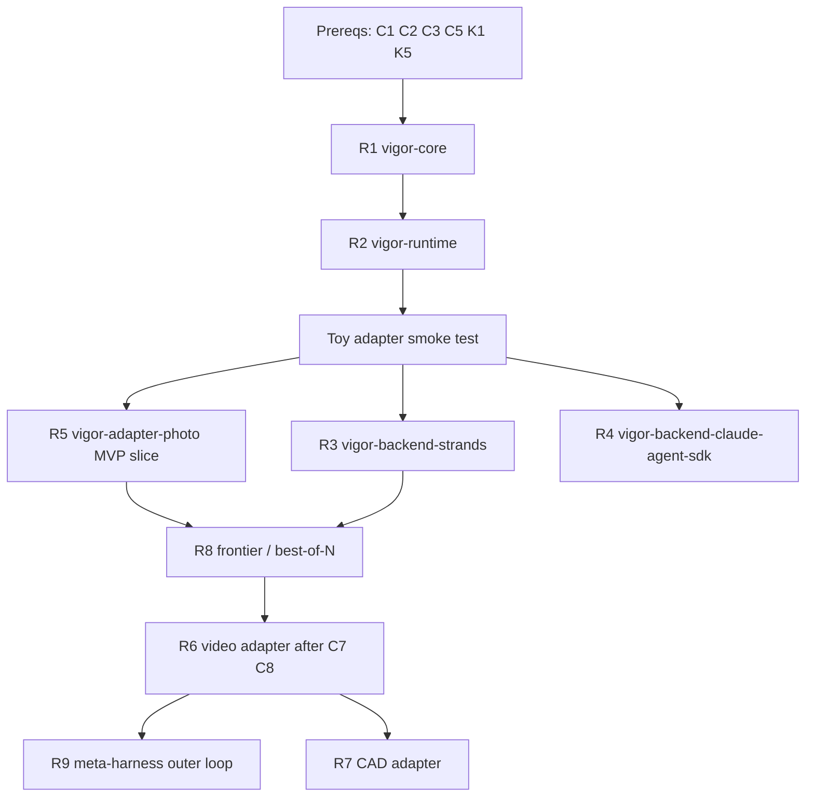

# VIGOR Implementation Readiness Assessment

Date: 2026-04-26
Status: Foundation packages (core, runtime, backends skeleton, photo adapter MVP) have shipped. Sections below describe residual blockers and deferred work.

This document is the output of a deep-work-loop readiness evaluation of the recommendations from ADR-0007, `docs/comparisons/vigor-vs-systems.md`, and `docs/roadmap.md`.

It answers: what is ready to build, what needs clarification first, what is blocked, and in what order.

## Executive Summary

| Status | Count | Items |
| --- | --- | --- |
| Shipped | 5 | `vigor-core`, `vigor-runtime`, `vigor-backend-strands` (skeleton), `vigor-backend-claude-agent-sdk` (skeleton), `vigor-adapter-photo` (MVP slice) |
| Partially shipped | 1 | Frontier selection (schema + logic in core; best-of-N orchestration deferred) |
| Blocked | 1 | `vigor-adapter-video-aiecf` (renamed to `vigor-adapter-video-manim` first; needs C7 + C8) |
| Deferred by sequencing | 2 | `vigor-adapter-cad`, Meta-Harness outer loop |

Prerequisite ADRs 0008–0011 landed. Apache-2.0 `LICENSE`, UV monorepo scaffolding, CI, `SECURITY.md`, `CONTRIBUTING.md`, and `.github/CODEOWNERS` all exist. The quality gate is green: ruff, ruff format, mypy strict, and pytest (39 tests across 5 packages).

## Readiness Method

Each recommendation was evaluated against:

1. Inputs exist in docs or must be created.
2. External dependencies are available.
3. Interface contracts are unambiguous.
4. Compute, credentials, and data access are available.
5. Sequencing dependencies on other recommendations.

Status values:

| Status | Meaning |
| --- | --- |
| READY | All inputs exist to start immediately. |
| NEEDS CLARIFICATION | A small set of decisions unblocks it. |
| BLOCKED | Significant dependency or missing input. |
| DEFERRED | Should come later based on explicit sequencing. |

## Cross-Cutting Prerequisites

These gate multiple recommendations and should be resolved first.

| ID | Prerequisite | Severity | Blocks | Recommended Resolution |
| --- | --- | --- | --- | --- |
| C1 | Language choice not decided | High | core, runtime, backends, adapters | New ADR: `vigor-core` is Python 3.11+. TypeScript bindings are out of scope for v0 but not ruled out. |
| C2 | No `LICENSE` file | High | all public packages | Add Apache-2.0 at the repo root. |
| C3 | Monorepo vs polyrepo undecided | High | packaging of 7+ packages | New ADR: single monorepo with workspace-style packaging (uv or hatch). `examples/` and `packages/` at root. |
| C4 | No CI | Medium | all | Minimal GitHub Actions: lint, type-check, unit tests, schema validation. |
| C5 | No package scaffolding | Medium | core, runtime | `pyproject.toml`, `src/` layout, ruff, mypy, pytest. |
| C6 | Model provider credentials and cost-budget policy | Medium | backends, VLM reviewers | Document required env vars and per-run cost ceilings. Add a `secrets` section to run provenance. |
| C7 | GPU compute availability | Medium to High | video adapter, learned scorers | Decide: cloud GPU, local, or shadow-only mode. |
| C8 | AIECF target repo access and identity | High | video adapter | Confirm whether VIGOR is integrating with an existing AIECF repo or building a standalone video adapter first. |
| C9 | Test data and corpora | Medium | photo, video, benchmark splits | Curate small seed sets per domain with clear licensing. |
| C10 | Tool sandboxing strategy | Medium | adapters running subprocess tools, outer loop | Pick subprocess + resource limits now, containers later. |
| C11 | Async vs sync runtime contract | Low to Medium | runtime, adapters, backends | Standardize async throughout. Reconcile framework doc with ADR-0007. |
| C12 | Observability stack | Low | non-blocking for MVP | VIGOR core emits structured logs and minimal OpenTelemetry spans; backends can extend. |

## Interface And Doc Conflicts That Must Be Resolved Before Coding

| ID | Conflict | Severity | Resolution |
| --- | --- | --- | --- |
| K1 | `DomainAdapter` signature differs between `vigor-framework.md` and `vigor-vs-systems.md`; ADR-0007 omits `DomainAdapter` | High | New small ADR that designates the async superset as authoritative and keeps both `plan_representation` and `apply_patch`. |
| K5 | Patch ownership is split between `DomainAdapter.patch` and `AgentBackend.patch` | Medium | Rename to disambiguate: `AgentBackend.propose_patch` (LLM-driven) vs `DomainAdapter.apply_patch` (deterministic IR transform). |
| K7 | `vigor-adapter-video-aiecf` assumes unverified AIECF integration | High | Rename or split: `vigor-adapter-video-manim` as standalone first; `vigor-adapter-video-aiecf` requires AIECF access confirmation. |
| K2 | Roadmap Phase 1 does not name `vigor-core` and `vigor-runtime` | Low | Update roadmap to map Phase 1 deliverables to the two core packages. |
| K3 | Frontier timing: schema from day one vs implementation in Phase 4 | Low | Schema and interface in `vigor-core` at Phase 1; multi-candidate scheduler in Phase 4. |
| K8 | Comparison doc markets TypeScript but ADR-0007 does not list a TS package | Low | Call out TS bindings as explicitly post-v0 in C1 ADR. |

## Per-Recommendation Readiness

### R1. `vigor-core`

Status: **NEEDS CLARIFICATION**

Inputs that exist:

- Runtime schemas (`docs/schemas/runtime-schemas.md`).
- Scoring and adjudication policy.
- Adapter and reviewer templates.
- Archive layout.

Inputs that do not exist:

- Decided language, license, repo layout.
- Package scaffold.
- Validation library choice (pydantic v2 recommended).
- Authoritative adapter interface (conflict K1 must be resolved).

Blockers: C1, C2, C3, C5, K1, K5.

Next steps:

1. Resolve C1, C2, C3 as ADRs.
2. Resolve K1 and K5 as a small ADR on the adapter and backend interfaces.
3. Scaffold `packages/vigor-core` with pydantic models for every schema in `docs/schemas/runtime-schemas.md`.
4. Add round-trip tests against JSON fixtures derived from the schemas doc.

### R2. `vigor-runtime`

Status: **NEEDS CLARIFICATION**

Inputs that exist:

- Eight-stage loop (`docs/vigor-framework.md`).
- Budget schema fields.
- Archive filesystem layout.

Inputs that do not exist:

- CLI framework choice.
- Async vs sync decision (C11).
- Persistence backend choice (filesystem first is implied but not codified).

Blockers: R1, C11.

Next steps:

1. Confirm filesystem-first archive with a pluggable `ArchiveStore` interface.
2. Pick Typer or Click for the CLI.
3. Ship a minimal in-process `AgentBackend` that echoes canned generation output so the loop can run without a model.
4. Deliver the roadmap Phase 1 exit criteria: a toy adapter runs end to end.

### R3. `vigor-backend-strands`

Status: **READY for skeleton (pending C1 and R1)**

Inputs that exist:

- Strands Python SDK is public.
- Strands capability mapping documented in `docs/comparisons/vigor-vs-systems.md`.

Inputs that do not exist:

- Core interface finalized (K1).

Blockers: C1, R1.

Next steps:

1. Implement `StrandsBackend` implementing `AgentBackend` and optionally `ToolBackend`.
2. Wire Strands `Agent`, `Graph`, and tool schema adapters.
3. Support MCP tool injection.
4. Add integration tests using a cheap model via Bedrock or OpenAI provider configuration.

### R4. `vigor-backend-claude-agent-sdk`

Status: **READY for skeleton (pending C1 and R1)**

Inputs that exist:

- Claude Agent SDK is public with Python and TypeScript versions.
- Permission modes and tool controls documented.

Inputs that do not exist:

- Policy for isolating VIGOR run archive from Claude Code sessions and checkpoints.
- Credentials and cost policy (C6).

Blockers: C1, C6, R1.

Next steps:

1. Implement `ClaudeAgentBackend` using `claude_agent_sdk.query`.
2. Route tool calls through VIGOR's `ToolBackend` where possible; otherwise accept Claude SDK tools as opaque.
3. Always persist the VIGOR canonical archive independent of Claude sessions.
4. Start with `permission_mode="plan"` for safety during development.

### R5. `vigor-adapter-photo`

Status: **NEEDS CLARIFICATION**

Inputs that exist:

- `photo_edit_recipe.v1` schema (`docs/adoption/photo-editing.md`).
- Reviewer list.
- Export lossiness matrix.

Inputs that do not exist:

- Chosen mask source (SAM, off-the-shelf, none for MVP).
- Chosen aesthetic critic (VLM vs small model, which provider).
- XMP subset to target.
- Test photo corpus with licensing.

Blockers: R1, C9.

Recommended scope for the MVP slice:

1. rawpy plus OpenCV for RAW preview and JPEG rendering.
2. Global adjustments only, no masks.
3. Histogram critic (pure Python).
4. One VLM aesthetic critic behind an optional reviewer.
5. JSON recipe plus a minimal XMP export.

Deferring masks and semantic reviewers to a later slice keeps scope buildable with current inputs.

### R6. `vigor-adapter-video-aiecf`

Status: **BLOCKED**

Inputs that exist:

- `educational_video.v1` schema.
- Adoption plan with assumptions-to-verify table.
- VideoScore2 citations.

Inputs that do not exist:

- Confirmed AIECF repo URL, license, and access (C8).
- GPU access for VideoScore2 (C7).
- Pipeline evidence: Manim, ffmpeg, Gemini or other VLM, queue system.

Blockers: R1, C7, C8.

Next steps:

1. Decide whether to build `vigor-adapter-video-manim` first as standalone and treat AIECF integration as a second package.
2. If keeping AIECF scope, confirm access and licensing before any code.
3. For VideoScore2, pick a GPU path or use it in shadow mode only for MVP.

### R7. `vigor-adapter-cad`

Status: **DEFERRED**

Inputs that exist:

- `cad_parametric.v1` schema.
- Compiler candidates listed.
- Safety policy and engineering metadata requirements.

Inputs that do not exist:

- Picked compiler: CadQuery vs FreeCAD vs OpenSCAD.
- Picked FEM solver.
- Test designs and load cases.
- Human signoff workflow.

Blockers: R1, roadmap sequencing (Phase 5).

Next steps:

1. Keep deferred until photo and video slices are in production.
2. During the wait, collect a small corpus of parametric design intents for benchmark use.

### R8. Frontier and Best-Of-N

Status: **READY after R1 and R2**

Inputs that exist:

- `Frontier` schema.
- Selection policy and disagreement thresholds in `docs/scoring-adjudication.md`.

Inputs that do not exist:

- Implementation of multi-candidate orchestration in `vigor-runtime`.

Blockers: R1, R2.

Next steps:

1. Implement `FrontierManager` in `vigor-runtime` once candidate graph is in place.
2. Start with a sequential best-of-N loop; add parallel candidates later.

### R9. Meta-Harness Outer Loop

Status: **DEFERRED**

Inputs that exist:

- ADR-0006 describes promotion gates and roles.
- Benchmark split terminology (search, validation, held-out test).

Inputs that do not exist:

- At least one adapter running end to end.
- Benchmark corpora for each domain.
- Sandboxing for harness candidates.
- Rollback and signoff tooling.

Blockers: R1, R2, R5 or another running adapter, C9, C10.

Next steps:

1. During photo and video adapter work, collect benchmark tasks into `benchmarks/photo/` and `benchmarks/video/`.
2. Do not start outer-loop implementation until one adapter is stable.

## Sequencing Plan

Recommended wave structure:

| Wave | Focus | Deliverables |
| --- | --- | --- |
| Wave A | Prerequisite ADRs | Language (C1), license (C2), repo layout (C3), adapter interface (K1), patch ownership (K5), rename or split video adapter (K7). |
| Wave B | Foundation | `vigor-core`, `vigor-runtime`, toy adapter, run archive, CI. |
| Wave C | First domain slice | `vigor-adapter-photo` MVP without masks. |
| Wave D | Backends | `vigor-backend-strands`, then `vigor-backend-claude-agent-sdk`. |
| Wave E | Frontier | `FrontierManager` and best-of-N. |
| Wave F | Second domain slice | Standalone `vigor-adapter-video-manim`. Upgrade to AIECF only after C8. |
| Wave G | CAD | Parametric adapter. |
| Wave H | Outer loop | Meta-Harness-style optimization over domain benchmarks. |

## Conflicts To Watch For During Implementation

1. Adapter and backend interfaces must stay small and async. Each backend and each adapter must implement the same contract. Changes to either require a new minor ADR.
2. Domain adapters must not import backend packages, and backends must not import domain adapters. Both depend only on `vigor-core`.
3. Reviewer outputs must match the schema in `docs/templates/review-report-schema.md`. Free-form VLM output needs a normalizer.
4. Provenance records must be written even on failure. Do not skip archives on error paths.
5. Meta-Harness outer-loop changes must be sandboxed. No harness patch may execute on production adapters without review and rollback.

## Action Items That Can Start Immediately

These do not require new research or external approval.

| Action | Owner | Effort |
| --- | --- | --- |
| Write ADR-0008: Language choice (Python 3.11+ for v0) | Maintainer | S |
| Add `LICENSE` (Apache-2.0) at the repo root | Maintainer | S |
| Write ADR-0009: Monorepo layout and package names | Maintainer | S |
| Write ADR-0010: Adapter, backend, and patch interfaces (reconciles K1 and K5) | Maintainer | M |
| Update roadmap to name `vigor-core` and `vigor-runtime` for Phase 1 | Maintainer | S |
| Rename `vigor-adapter-video-aiecf` to `vigor-adapter-video-manim` or scope-gate it behind AIECF confirmation | Maintainer | S |
| Scaffold `packages/vigor-core` with pydantic schemas and tests | Maintainer | M |
| Scaffold `packages/vigor-runtime` with toy adapter | Maintainer | M |
| Add minimal CI: ruff, mypy, pytest, schema validation | Maintainer | S |

## Decision Checkpoint

Before any code is written, confirm the following with the project owner:

1. Target language is Python 3.11+ for v0.
2. License is Apache-2.0.
3. Layout is a single monorepo with a `packages/` and `examples/` tree.
4. First adapter is standalone photo editing, without semantic masks in MVP.
5. Video adapter is scoped to standalone Manim first. AIECF integration is a separate package that requires external repo access.
6. Meta-Harness outer loop is deferred until one adapter is stable.

If any of these are rejected, the readiness assessment should be re-run before starting Wave B.
