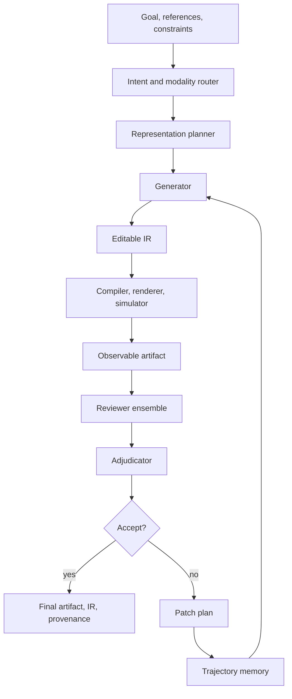
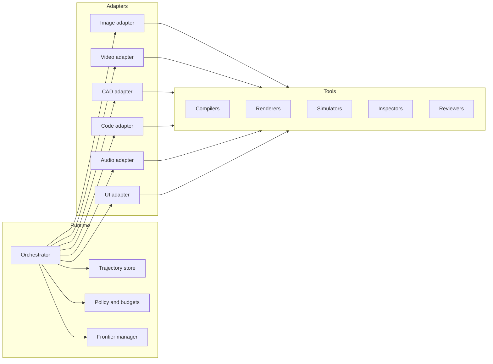
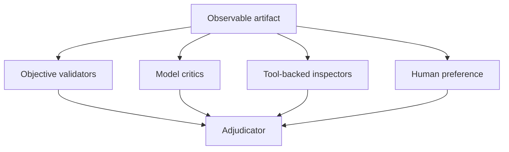

# VIGOR Framework Architecture

## Definition

**VIGOR** is a universal generate-compile-review framework for AI-based asset generation and refinement.

It represents every generated output as an editable intermediate representation, compiles or renders that representation into an observable artifact, reviews the artifact with domain-specific evaluators, and iterates until acceptance criteria are met or a budget is exhausted.



## Design Goals

VIGOR should be:

| Goal | Meaning |
| --- | --- |
| Modality-agnostic | The same orchestration model should support images, video, CAD, code, audio, documents, simulations, and robotics. |
| Representation-first | The primary output is editable and executable, not an opaque blob. |
| Tool-grounded | Every iteration should collect evidence from compilers, renderers, simulators, validators, or reviewers. |
| Reviewable | Generated artifacts should be scored, critiqued, and compared before acceptance. |
| Reproducible | Runs should persist artifacts, prompts, tool calls, metrics, decisions, and stop reasons. |
| Adapter-based | Domain-specific engines should plug into a common runtime contract. |
| Bounded | Every loop needs iteration, time, compute, and cost limits. |

## Relationship To VIGA

VIGA is an analysis-by-synthesis agent for programmatic visual reconstruction. Its README describes an iterative loop of generating, rendering, and verifying scenes against target images. It uses a Generator that writes and executes scene programs and a Verifier that examines rendered output from multiple viewpoints, identifies visual discrepancies, and provides feedback for the next iteration. VIGA supports BlenderBench, BlenderGym, SlideBench, custom static 3D scenes, and custom dynamic 4D scenes.

VIGOR generalizes VIGA by replacing graphics-specific terms with modality-neutral contracts.

| VIGA | VIGOR |
| --- | --- |
| Target image | Goal, references, constraints |
| Blender/PPTX code | Editable intermediate representation |
| Render | Compile, render, simulate, execute, or preview |
| Visual verifier | Reviewer ensemble |
| Render history | Artifact trajectory and provenance |
| Scene edit | Representation patch |
| Blender/PPTX tool servers | Domain adapters and tool providers |

The important generalization is that **render** means any observable projection of a representation. For code, rendering can be a test run or deploy preview. For CAD, it can be a mesh, constraint report, simulation trace, or slicer output. For photo editing, it can be an edited preview plus mask overlays and histogram metrics.

## Core Loop

The framework loop has eight stages.

### 1. Intent And Modality Routing

The router converts the user goal into a structured task.

```json
{
  "goal": "Create a warm cinematic edit of this forest cabin photo",
  "modalities": ["image", "photo_edit_recipe"],
  "references": ["input.raw"],
  "constraints": ["preserve natural greens", "avoid clipped highlights"],
  "target_outputs": ["preview.jpg", "lightroom.xmp", "recipe.json"]
}
```

### 2. Representation Planning

The representation planner chooses the intermediate representation and adapter stack.

| Task | Candidate IR |
| --- | --- |
| Agentic video | Storyboard JSON, timeline graph, Manim code, Blender Python, HTML animation |
| CAD | Feature tree, OpenSCAD script, FreeCAD Python, STEP-backed constraint graph |
| Photo editing | XMP-like recipe, mask graph, layer stack, LUT, GIMP GEGL graph |
| UI design | HTML/CSS/React, design tokens, Figma-like node graph |
| Audio | DAW graph, ffmpeg filter graph, plugin chain, MIDI arrangement |
| Robotics | Behavior tree, trajectory plan, policy config, task-and-motion plan |
| Data workflow | SQL, notebook cells, dataframe pipeline, visualization spec |

### 3. Generation

The generator produces a candidate representation. It may use one model call, a multi-agent planner/generator pair, or a specialist team.

Generation should output:

```json
{
  "candidate_id": "cand_0007",
  "ir_type": "photo_edit_recipe.v1",
  "ir_uri": "runs/run_001/candidates/cand_0007/recipe.json",
  "hypothesis": "Warm the sky and cabin while preserving moody foreground shadows",
  "expected_improvement": ["subject visibility", "warm cinematic tone"],
  "known_risks": ["oversaturated greens", "halo around ridgeline"]
}
```

### 4. Compilation, Rendering, Simulation, Or Execution

The compiler materializes the IR.

```json
{
  "candidate_id": "cand_0007",
  "compiler": "photo.rawpy_renderer.v1",
  "inputs": ["input.raw", "recipe.json", "masks/*.png"],
  "outputs": ["preview.jpg", "histogram.json", "mask_overlay.jpg"],
  "exit_status": "success",
  "warnings": ["highlight clipping 0.4 percent"]
}
```

Execution failures are not incidental. They are review evidence. Compiler errors, render failures, invalid meshes, test failures, and simulator crashes should feed the next patch plan.

### 5. Review

Reviewers evaluate the observable artifact and sometimes the IR itself.

Reviewer classes include:

| Reviewer Class | Examples |
| --- | --- |
| Objective metrics | Unit tests, type checks, contrast ratio, clipping, mesh validity, LUFS, collision count |
| Learned scorers | VideoScore2, aesthetic models, CLIP-like alignment, reward models, neural encoders |
| VLM/LLM critics | Design critique, semantic alignment, readability, common-sense review |
| Tool-backed inspectors | Playwright interaction, CAD constraint solver, slicer, physics simulator, image histogram |
| Human feedback | A/B preference, inline comments, accept/reject, style tuning |

Reviewers must return structured reports. Free-form praise is not sufficient.

### 6. Adjudication

The adjudicator merges reviewer reports, resolves disagreement, chooses accept/refine/branch/escalate, and writes the next patch objective.

Adjudication policy should consider:

| Signal | Role |
| --- | --- |
| Hard objective failure | Blocks acceptance |
| Subjective reviewer disagreement | Triggers best-of-N, human review, or another review pass |
| Score plateau | Stops refinement or pivots strategy |
| Cost or latency budget | Stops or narrows the loop |
| Safety or policy violation | Blocks and records escalation |

### 7. Patch Planning

The patch planner converts review evidence into a targeted change.

```json
{
  "candidate_id": "cand_0007",
  "next_action": "patch",
  "patch_objectives": [
    "Reduce green saturation in foliage mask by 8 to 12 points",
    "Raise cabin exposure locally by 0.2 EV",
    "Keep global blacks unchanged"
  ],
  "do_not_change": ["foreground mood", "overall warm grade"],
  "basis": ["review.aesthetic.003", "metric.histogram.002"]
}
```

### 8. Finalization

The final output includes:

| Output | Purpose |
| --- | --- |
| Final artifact | The rendered or executable result for users |
| Final IR | The editable recipe, code, CAD graph, timeline, or policy |
| Review report | Scores, findings, threshold decisions, residual risk |
| Provenance | Inputs, model calls, tool calls, versions, hashes, iterations, stop reason |
| Downstream adapters | Exported XMP, PSD, GIMP script, STEP, HTML, MP4, JSON, etc. |

## Runtime Components



### Orchestrator

Responsibilities:

| Responsibility | Detail |
| --- | --- |
| Route task | Select domain adapter and IR |
| Enforce contracts | Validate adapter capabilities, schemas, required tools |
| Run loop | Generate, compile, review, adjudicate, patch |
| Manage budgets | Iteration, token, tool, compute, time, cost |
| Manage branches | Best-of-N, beam search, pivot strategy, frontier selection |
| Persist state | Store trajectory, artifacts, reports, provenance |
| Stop safely | Accept, fail, escalate, or request human input |

### Domain Adapter

A domain adapter packages a modality-specific toolchain behind a common interface.

Minimum methods:

```python
class DomainAdapter:
    def describe_capabilities(self) -> AdapterManifest: ...
    def plan_representation(self, task: TaskSpec) -> RepresentationPlan: ...
    def validate_ir(self, ir: ArtifactIR) -> ValidationReport: ...
    def compile(self, ir: ArtifactIR, context: RunContext) -> CompileResult: ...
    def review(self, artifact: ObservableArtifact, context: RunContext) -> list[ReviewReport]: ...
    def patch(self, ir: ArtifactIR, adjudication: AdjudicationReport) -> ArtifactIR: ...
    def export(self, ir: ArtifactIR, artifact: ObservableArtifact) -> ExportBundle: ...
```

### Tool Provider

Tool providers expose capabilities such as compilers, renderers, simulators, inspectors, and scorers.

Tools should declare:

| Field | Purpose |
| --- | --- |
| `tool_id` | Stable identifier |
| `capability` | Compile, render, simulate, inspect, score, patch, export |
| `inputs` | Accepted schemas and media types |
| `outputs` | Output schemas and media types |
| `mutability` | Read-only or state-mutating |
| `cost_model` | Expected latency, compute, money, memory |
| `failure_modes` | Known errors and retry policy |

VIGA's separation between generator tools and verifier tools should become a hard VIGOR capability distinction: **mutating tools change state; observing tools only inspect state**.

### Reviewer Ensemble

VIGOR uses independent reviewers instead of trusting self-review.



Reviewer outputs need evidence. A useful finding includes severity, affected artifact, evidence, rule or rubric, suggested fix, and confidence.

### Frontier Manager

The final candidate is not always the last iteration. Design, photo editing, video generation, and CAD often improve non-monotonically. The frontier manager keeps candidate variants and chooses the best candidate according to explicit criteria.

Frontier dimensions can include:

| Dimension | Example |
| --- | --- |
| Quality | Aesthetic score, video score, human preference |
| Correctness | Test pass rate, constraint satisfaction, prompt alignment |
| Cost | Runtime, API cost, GPU time |
| Simplicity | Smaller code, simpler CAD feature tree, fewer layers |
| Editability | Cleaner IR, fewer destructive operations |
| Safety | Policy pass, no manufacturing hazard, no unsafe robot action |

## Memory And Provenance

VIGOR should store durable state as files or database records, not only chat transcript.

```text
runs/<run_id>/
  task.json
  adapter_manifest.json
  candidates/
    cand_0001/
      ir.json
      compile_result.json
      artifacts/
      reviews/
      adjudication.json
      patch_plan.json
    cand_0002/
      ...
  frontier.json
  final/
    artifact.*
    ir.*
    review_report.json
    provenance.json
```

Provenance should answer:

| Question | Required Data |
| --- | --- |
| What changed? | IR diff, patch plan, artifact diff |
| Why did it change? | Reviewer findings and adjudication decision |
| What produced it? | Model, prompt, tool, version, seed/config |
| Was it verified? | Scores, test results, validations, thresholds |
| Why did the loop stop? | Acceptance, budget, plateau, human decision, failure |

## Modes Of Operation

| Mode | Behavior |
| --- | --- |
| One-shot seed | Generate initial candidate, compile, review once, no automatic patch |
| Automatic refinement | Iterate until pass, plateau, or budget |
| Interactive refinement | User reviews candidates and gives inline/structured feedback between rounds |
| Best-of-N | Generate multiple independent candidates, compile/review all, select or merge best |
| Beam search | Keep several candidate branches and evolve the frontier |
| Harness optimization | Evolve the VIGOR adapter, prompts, reviewer weights, and memory policy over benchmark sets |

## Safety And Governance

VIGOR should include guardrails appropriate to each domain.

| Domain | Governance Need |
| --- | --- |
| CAD | Physical safety, manufacturability, material constraints, regulatory checks |
| Robotics | Collision, force, zone, and human-safety constraints |
| Photo/video | Consent, identity preservation, disclosure, deepfake restrictions |
| Code | Secrets, security vulnerabilities, destructive operations, license compliance |
| Education | Accuracy, accessibility, age appropriateness, hallucination control |

Safety gates should be objective where possible and advisory where subjective. Safety-critical domains should require human approval before final export or real-world actuation.

## Acceptance Criteria For A VIGOR Implementation

A working VIGOR runtime should demonstrate:

| Criterion | Test |
| --- | --- |
| Adapter contract | At least two domain adapters can run through the same orchestrator |
| Editable IR | Final output includes an editable representation, not only a rendered asset |
| Evidence loop | At least one compile/review failure can be turned into a targeted patch |
| Provenance | Run archive contains candidates, artifacts, reviews, and stop reason |
| Reviewer separation | At least one independent reviewer evaluates generator output |
| Bounded execution | Max iterations, timeouts, and escalation are enforced |
| Frontier selection | Best candidate can be selected from non-final iterations |
