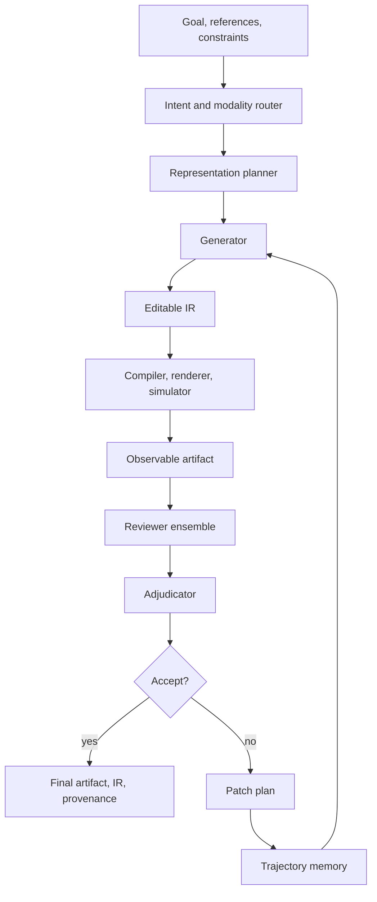

# VIGOR Framework Architecture

## Definition

**VIGOR** is a proposed modality-agnostic generate-compile-review framework for AI-based asset generation and refinement.

It represents every generated output as an editable intermediate representation, compiles or renders that representation into an observable artifact, reviews the artifact with domain-specific evaluators, and iterates until acceptance criteria are met or a budget is exhausted.



## Core Runtime Contract

The implementation is Python 3.11+ and async-first.

```python
class DomainAdapter:
    async def describe_capabilities(self) -> AdapterManifest: ...
    async def plan_representation(self, task: TaskSpec) -> RepresentationPlan: ...
    async def validate_ir(self, ir: ArtifactIR) -> ValidationReport: ...
    async def compile(self, ir: ArtifactIR, context: RunContext) -> CompileResult: ...
    async def review(
        self, artifact: ObservableArtifact, ir: ArtifactIR, context: RunContext
    ) -> list[ReviewReport]: ...
    async def apply_patch(self, ir: ArtifactIR, patch: PatchPlan) -> ArtifactIR: ...
    async def export(
        self, ir: ArtifactIR, artifact: ObservableArtifact, context: RunContext
    ) -> ExportBundle: ...

class AgentBackend:
    async def generate(self, request: GenerationRequest) -> GenerationResult: ...
    async def review(self, request: ReviewRequest) -> ReviewResult: ...
    async def propose_patch(self, request: PatchProposalRequest) -> PatchProposal: ...
    async def aclose(self) -> None: ...
```

`AgentBackend.propose_patch` proposes; `DomainAdapter.apply_patch` mutates IR deterministically. This preserves editable artifact authority inside the domain adapter.

## Runtime Components

| Component | Package | Status |
| --- | --- | --- |
| Core schemas/interfaces/archive/scoring/frontier | `vigor-core` | shipped |
| Orchestrator, CLI, echo backend, toy adapter | `vigor-runtime` | shipped |
| Strands backend skeleton | `vigor-backend-strands` | shipped |
| Claude Agent SDK backend skeleton | `vigor-backend-claude-agent-sdk` | shipped |
| Photo editing adapter | `vigor-adapter-photo` | shipped deterministic MVP |
| Standalone Manim video adapter | `vigor-adapter-video-manim` | shipped first slice |
| CAD/OpenSCAD adapter | `vigor-adapter-cad` | shipped first slice |
| Harness evaluator | `vigor-harness` | shipped minimal evaluator |

## Relationship To VIGA

VIGA is an analysis-by-synthesis agent for programmatic visual reconstruction. It uses Generator and Verifier roles to generate executable scene code, render it, inspect visual discrepancies, and revise. VIGOR generalizes that graphics-specific loop into modality-neutral contracts:

| VIGA | VIGOR |
| --- | --- |
| Target image | Goal, references, constraints |
| Blender/PPTX code | Editable intermediate representation |
| Render | Compile, render, simulate, execute, or preview |
| Visual verifier | Reviewer ensemble |
| Render history | Artifact trajectory and provenance |
| Scene edit | Representation patch |

## Eight-Stage Loop

1. Route task and choose domain adapter.
2. Plan representation.
3. Generate one or more candidate IRs (`Budgets.max_candidates`).
4. Validate and compile each candidate.
5. Review each observable artifact.
6. Adjudicate review reports and build a frontier.
7. Accept/export the best accepted candidate, or propose/apply a patch and iterate.
8. Persist final artifacts, export bundle, frontier, and provenance.

## Memory And Provenance

Every run persists a filesystem archive:

```text
runs/<run_id>/
  task.json
  adapter_manifest.json
  candidates/<candidate_id>/
    ir.json
    compile_result.json
    reviews/<review_id>.json
    adjudication.json
    patch_plan.json
    artifacts/
  errors/<error_id>.json
  frontier.json
  final/
    export_bundle.json
    provenance.json
```

Archive writes use path containment checks and all filesystem-derived ids are schema-constrained.

## Reviewer Ensemble

Reviewers return structured `ReviewReport` records. The adjudicator applies hard gates, reviewer `passed` status, requested actions, minimum thresholds, disagreement thresholds, and optional weighted composites.

## Frontier And Best-Of-N

The runtime evaluates up to `TaskSpec.budgets.max_candidates` candidates in a wave. Only candidates whose adjudication `decision == "accept"` are selectable in the final frontier. Patch/branch/pivot candidates may be kept as evidence but cannot become `selected`.

`Budgets.parallel_candidates` (default `1`) caps fanout within a wave. Higher caps run candidate generation and evaluation under chunked `asyncio.gather` (chunks of `min(parallel_candidates, max_candidates)`), trading one batch's worth of bounded budget overshoot for a 2–4× wall-clock improvement on canonical configurations. Candidate IDs remain stable (`cand_<task>_<NNNN>` indexed before fanout); on-disk write order under `runs/<run_id>/candidates/` becomes nondeterministic. See [ADR-0034](adr/0034-parallel-best-of-n-via-asyncio-gather.md).

## Safety And Governance

1. Generated executable code (for example Manim scene Python) is untrusted. The default Manim adapter refuses real subprocess execution unless explicitly configured or a sandboxed runner is injected.
2. Archive paths are contained under the archive root.
3. Harness evaluator dynamic imports are allowlist-gated.
4. Safety-critical CAD/robotics/medical workflows require qualified human approval.
